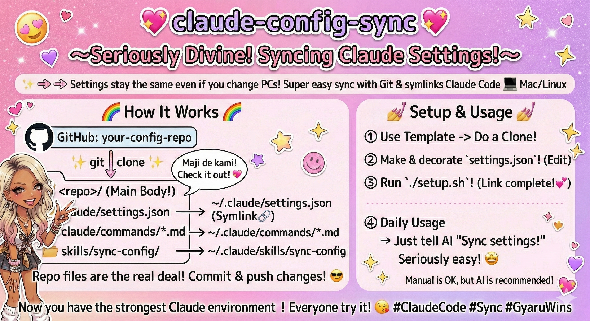

# claude-config-sync


```
👄 Hey AI, I have got new skills. Sync them!!
🤖 Pi-...Gagaga... OKANOSHITA(Confirmed). Will thim synced.  (Sync done!
👄 Cool !!
```

Share Claude Code settings, commands, and skills across multiple machines (Linux, macOS) using Git and symlinks.

## How It Works

Files in this repository are symlinked into `~/.claude/`. When Claude Code modifies a setting, the change is written directly to the repo — just commit and push to propagate it to other machines.

```
┌─────────────────────────────────┐
│  GitHub: your-config-repo       │
└──────────┬──────────────────────┘
           │ git clone
           ▼
┌─────────────────────────────────┐
│  <repo>/                        │  Files live here (single source of truth)
│  ├── claude/                    │
│  │   ├── settings.json         ─┼──→ ~/.claude/settings.json
│  │   └── commands/*.md         ─┼──→ ~/.claude/commands/*.md (per-file links)
│  └── skills/                    │
│      └── sync-config/          ─┼──→ ~/.claude/skills/sync-config
└─────────────────────────────────┘
```

## Setup

### 1. Use This Template

Click **"Use this template"** on GitHub, or clone directly:

```bash
git clone https://github.com/<your-username>/<your-repo>.git ~/path/to/config
```

### 2. Configure Settings

Copy the example settings and edit to your needs:

```bash
cd ~/path/to/config
cp claude/settings.json.example claude/settings.json
# Edit claude/settings.json with your permissions and plugins
```

### 3. Run Setup

```bash
chmod +x setup.sh
./setup.sh
```

This creates symlinks from `~/.claude/` pointing into the repo.

### 4. Verify

```bash
ls -la ~/.claude/settings.json    # Should be a symlink
claude /skills                     # sync-config should appear
```

## Daily Usage

### Let AI Handle It (Recommended)

From any project, just ask Claude Code in natural language:

```
"Share my new skills"
"Sync my config"
"Pull the latest settings from my other machine"
```

The `sync-config` skill is invoked automatically and handles import, diff, commit, push, and pull.

### Manual Workflow

**Push changes:**
```bash
cd ~/path/to/config
./setup.sh --import              # Import any new skills/commands
git add -A && git commit -m "Update settings" && git push
```

**Pull on another machine:**
```bash
cd ~/path/to/config
git pull && ./setup.sh
```

## setup.sh Options

| Command | Action |
|---|---|
| `./setup.sh` | Create symlinks from repo → `~/.claude/` |
| `./setup.sh --import` | Import unmanaged skills/commands into repo, then link |
| `DRY_RUN=1 ./setup.sh` | Dry run (preview changes without modifying anything) |
| `./setup.sh --dry-run` | Same as above |

## What Gets Synced

| Path | Description |
|---|---|
| `claude/settings.json` | Permissions and plugin configuration |
| `claude/commands/*.md` | Custom slash commands |
| `skills/*/` | Skill definitions (SKILL.md + supporting files) |

## Adding Your Own Content

### Add a Skill

Place or install skills anywhere, then import them:

```bash
./setup.sh --import    # Picks up skills from ~/.claude/skills/ and ~/.agents/skills/
```

Or manually create a directory under `skills/`:

```
skills/my-skill/
└── SKILL.md
```

### Add a Command

Place `.md` files in `claude/commands/`:

```
claude/commands/my-command.md
```

Then run `./setup.sh` to create the symlink.

## Setting Up a New Machine

1. Install Claude Code and launch it once (creates `~/.claude/`)
2. Clone this repo
3. Run `./setup.sh`
4. Launch Claude Code — your settings, commands, and skills are ready

## Notes

- `setup.sh` backs up existing files as `.bak` before replacing them
- Already-correct symlinks are skipped (safe to re-run)
- Works on both Linux and macOS (no `readlink -f` dependency)
- `settings.json` is not included in the template — copy from `.example` and customize
- The `--import` flag also scans `~/.agents/skills/` for legacy skill locations
